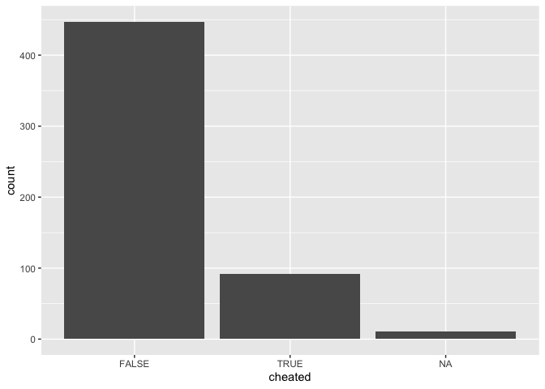
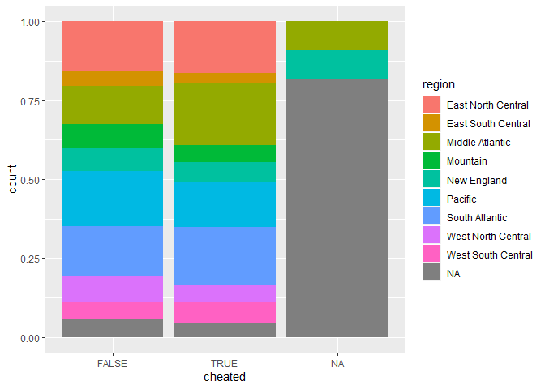
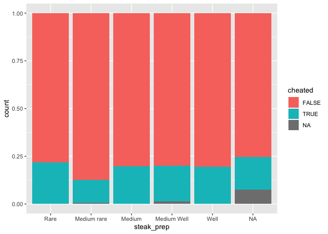
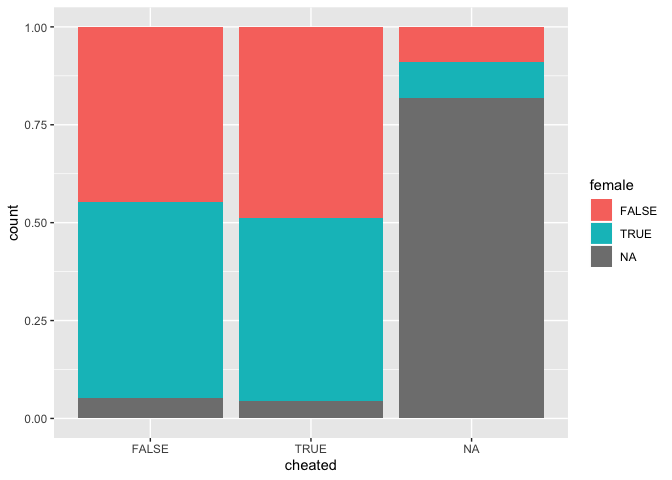
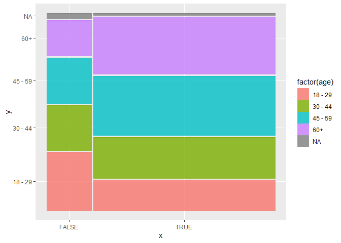
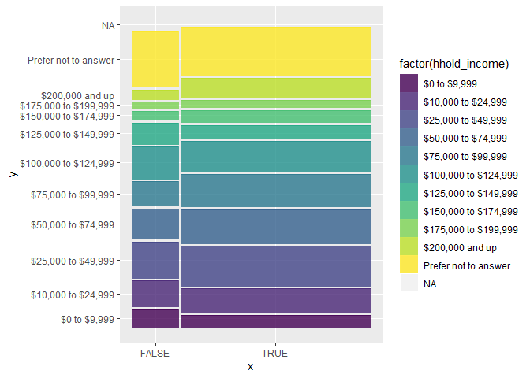
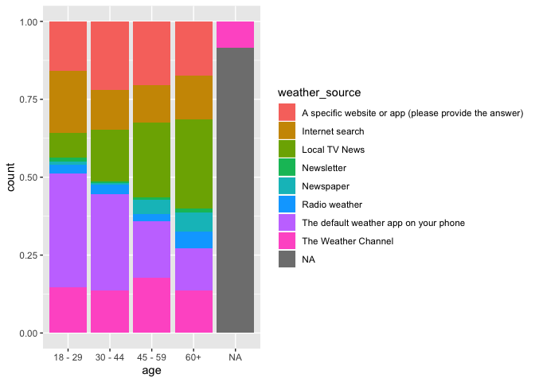

Welcome to the group project!


```r
library(fivethirtyeight)
library(tidyverse)
library(ggmosaic)
```


```r
steak_survey %>% 
  ggplot()+
  geom_bar(aes(x=steak_prep, fill=smoke), position = "fill")
```

<!-- -->


```r
steak_survey %>% 
  ggplot()+
  geom_bar(aes(x=steak_prep, fill=region), position = "fill")
```

<!-- -->


```r
steak_survey %>% 
  ggplot()+
  geom_bar(aes(x=steak_prep, fill=cheated), position = "fill")
```

<!-- -->


```r
weather_check %>%
  ggplot() +
  geom_count(aes(x = ck_weather, y = hhold_income), color = "cornflowerblue")
```

<!-- -->


```r
weather_check %>%
  ggplot() +
  geom_mosaic(aes(x = product(factor(age),ck_weather), fill = factor(age)))
```

<!-- -->


```r
weather_check %>%
  ggplot() +
  geom_mosaic(aes(x = product(factor(hhold_income),ck_weather), fill = factor(hhold_income)))
```

<!-- -->


```r
weather_check %>% 
  ggplot()+
  geom_bar(aes(x=age, fill=weather_source), position = "fill")
```

<!-- -->


